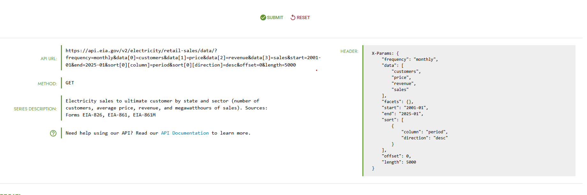
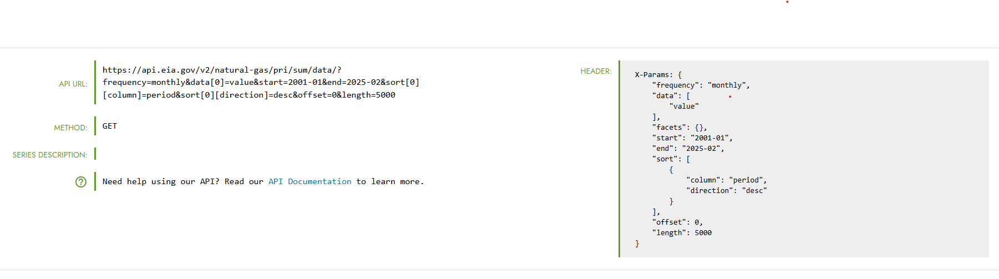

### 1. Dataset Selection Justification

**Source and scope:**

  EIA Electricity sales to ultimate customer by state and sector

  EIA Natural Gas Prices

**Access verification:**

 
 

**Relational depth:**

  Joining both tables, Electricity & Natural Gas Prices by state(region)

**Temporal characteristics:**

  Monthly  from January 2001 to January 2025

**Why this dataset:**

  A couple of years after I moved out, electricity costs seemed random, though there are multiple factors affecting the price.

  During my undergraduate studies, one of my professors testified in court, arguing whether electricity costs were fair. Where he calculated the WACC and mentioned that the electric companies had the free will to pick what to charge and that some would abuse their position, overcharging

### 2. Initial Problem Space

**Domain observations:**

  On the Electricity dataset some states have all 0's for the transportation sector. For example Alabama & Alaska.

  On the Natural Gas Prices dataset, the naming format for area-name varies. It can be COLORADO or USA-NC.

  Be mindful in what units the prices are $/MCF(U.S dollar per 1,000 cubic ft of natural gas) vs price units , revenue units, sales-units
    
**Candidate problems:**

  Analyze the correlation between input costs (Natural Gas Spot Prices) and output prices (Residential Electricity Rates) over a 20 + year period

  Compare the premium paid by Residential Customers vs Industrial and track the ratio over time. Has the increase been similar across sectors?AI-Bubble maybe see a exponential spike in industrial?

  Predict future residential electricity costs for states based on seasonal trends and fuel prices. Might make it more specific  for HCOL states and its income/pay growth.(would need other data)

**Questions you can't yet answer:**

  How to approach the different units these commodities are measured. Apples vs Oranges situation?

  What percentage of the gap is due to hidden costs like infrastructure,maintenance?

  Regulated vs unregulated electric companies/states?

  My third business problem would require one more dataset, which should not be hard to retrieve. The data would have to contain year,state, median income by household.

### 3. Architecture Characteristics Discovery

**Candidate characteristics:**

  Configurability - ability to adjust the parameters for specific questions for example different date ranges,variables, etc.

  Extensibility - To target specific segments of customers for example my 3rd business problem this will be crucial in adding multiple datasets without causing issues in terms of functionality. 

  Leverageability/reuse - reusing code can save time, especially when gathering data from different sources but having similar structure.

  Maintainability - Keeping the various formatting align such as units or states abbreviations.

  Archivability - If any corrections are release by government/regulatory bodies we will need flexibility in retrieving/deleting/correcting.

**Tensions you anticipate:**

  I suspect extensibility and usability will have conflict because being able to accept various datasets will call for a more complex design leading to a user interface that can be harder to navigate.

  Another one that stands out is its archivability and maintainability. The storing of monthly records over the span of 20+ years will require more maintenance in general.

**What you don't know yet:**
   
  Authentication & Authorization - I dont know who the end user will be yet. 

  Performance - what amount of resources will be required.what time frame are we looking for? monthly records over the span of 5 years?10 years? 20 years?

  Portability - where are we storing the data? what operating systems will use it?
