# Shortage Scout — Pipeline Architecture Diagram

**What this diagram shows:** The runtime components, their roles, the sequential
data flow through the five pipeline filters, the injected weight configuration,
and all file artifacts written to disk. Class and function detail is omitted;
see source files `acquire.py`, `transform.py`, and `pipeline.py` for
implementation specifics.

**Line types:**
| Line | Meaning |
|------|---------|
| `──►` solid arrow | Data flow or invocation |
| Label on arrow | Describes what is passed or written |

```mermaid
---
title: Shortage Scout — Pipeline Architecture and Data Flow
---
flowchart TD

    %% ─── External Source ─────────────────────────────────────────
    FRED(["FRED API\napi.stlouisfed.org"]):::external

    %% ─── Orchestrator ────────────────────────────────────────────
    ORCH["pipeline.py · run_pipeline()\nOrchestrates all filters\nInjects asymmetric weights"]:::orchestrator

    %% ─── Pipeline Filters ────────────────────────────────────────
    subgraph PIPE["Pipeline — Sequential, Unidirectional  ·  ADR-002"]
        direction TB
        F1["Filter 1 — Ingestion\nacquire.fetch_all()\nFetch · Retry up to 2× · Archive raw payload"]:::filter
        F2["Filter 2 — Normalization\npct_change()\nMonth-over-month % Δ per series"]:::filter
        F3["Filter 3 — Validation\nAssert all values ∈ [−1.0, 1.0]\nFail-fast on out-of-range data  ·  ADR-004 / ADR-005"]:::filter
        F4["Filter 4 — Smoothing\nrolling(3).mean()\n3-month rolling average"]:::filter
        F5["Filter 5 — Calculation\nWeighted S_score\nOVERBUY when S_score &lt; 0 · else HOLD"]:::filter
    end

    %% ─── Weight Configuration ────────────────────────────────────
    WEIGHTS["Asymmetric Weights  ·  ADR-006\nIPG3344S           +1.0  Industrial Production\nCAPUTLG3344SQ  +1.0  Capacity Utilization\nA34STI               +1.0  Inventories\nPCU334413334413  −1.0  PPI  (price spike = bad supply signal)"]:::config

    %% ─── File Artifacts ──────────────────────────────────────────
    subgraph FILES["File System Outputs  ·  ADR-003"]
        direction TB
        CSV1[/"Per-series raw values\n{series_id}.csv"/]:::artifact
        JSON_RAW[/"Point-in-time audit archive\n{series_id}_{timestamp}.json"/]:::artifact
        CSV_CMB[/"All series wide-format\ncombined.csv"/]:::artifact
        JSON_OUT[/"Final scored output\ntransformed.json"/]:::artifact
    end

    %% ─── Legend ──────────────────────────────────────────────────
    subgraph LEGEND["Legend"]
        direction LR
        LE(["External System"]):::external
        LO["Orchestrator"]:::orchestrator
        LF["Pipeline Filter\naccepts DataFrame · returns DataFrame"]:::filter
        LC["Configuration / Business Rule"]:::config
        LA[/"File Artifact\n(flat file on disk)"/]:::artifact
    end

    %% ─── Connections ─────────────────────────────────────────────
    ORCH -->|"invokes with 4-series list + output dir"| F1
    FRED -->|"HTTP GET · 4 semiconductor series"| F1

    F1 -->|"dict[series_id → pd.Series]"| F2
    F2 -->|"pct_change DataFrame"| F3
    F3 -->|"validated DataFrame\nraises ValueError on bad data"| F4
    F4 -->|"rolling mean DataFrame"| F5
    WEIGHTS -->|"injected by orchestrator at startup"| F5

    F1 -->|"writes one file per series"| CSV1
    F1 -->|"archives full FRED JSON payload"| JSON_RAW
    F1 -->|"writes combined series"| CSV_CMB
    F5 -->|"writes scored output"| JSON_OUT

    %% ─── Styles ──────────────────────────────────────────────────
    classDef external     fill:#f5a623,stroke:#c47d0e,color:#000,font-weight:bold
    classDef orchestrator fill:#4a90d9,stroke:#2c6aa0,color:#fff,font-weight:bold
    classDef filter       fill:#7ed321,stroke:#5a9a18,color:#000
    classDef artifact     fill:#9b9b9b,stroke:#4a4a4a,color:#fff
    classDef config       fill:#bd10e0,stroke:#8b0aa4,color:#fff
```

## Component Reference

| Component | File | Role |
|-----------|------|------|
| `run_pipeline()` | `Foundation3/pipeline.py` | Top-level orchestrator; wires filters and injects weights |
| Filter 1 — Ingestion | `Foundation3/acquire.py · fetch_all()` | Fetches FRED series via HTTP, retries on failure, writes CSV + JSON archives |
| Filter 2 — Normalization | `Foundation3/transform.py · transform_combined()` | Computes month-over-month percent change for all series |
| Filter 3 — Validation | `Foundation3/transform.py · transform_combined()` | Asserts all pct_change values fall within [−1.0, 1.0]; raises `ValueError` otherwise |
| Filter 4 — Smoothing | `Foundation3/transform.py · transform_combined()` | Applies 3-month rolling mean to smooth noise |
| Filter 5 — Calculation | `Foundation3/transform.py · transform_combined()` | Computes weighted S_score and emits OVERBUY / HOLD recommendation |
| Asymmetric Weights | `Foundation3/pipeline.py · ASYMMETRIC_WEIGHTS` | Encodes business rule: PPI receives −1.0 weight (ADR-006) |

## ADR Cross-Reference

| ADR | Decision | Impact on diagram |
|-----|----------|-------------------|
| ADR-001 | Use exactly 4 semiconductor FRED series | FRED API → Filter 1: exactly 4 HTTP GETs |
| ADR-002 | Pipeline over Microservices | 5 sequential filters; single deployable artifact |
| ADR-003 | File-based output over database | All persistence shown as flat files |
| ADR-004 | Fail-fast on missing data | Filter 3 raises `ValueError`; no partial output |
| ADR-005 | Strict NaN handling | `dropna(how="any")` enforced before smoothing |
| ADR-006 | Asymmetric PPI weighting | Weight config node shows PPI at −1.0 |
| ADR-007 | Archive raw JSON payloads | `{series_id}_{timestamp}.json` artifact shown |
