# CIDM 6330 Documentation
Some of the subject matter reasoning attached to the academic aims of this course are outlined and discussed here.

|Schedule           | Topic                                             | Readme Section Heading    |    
|-------------------|---------------------------------------------------|---------------------------|
|00: 01/16 – 01/20  | Design Orientation                                | [Design Foundations - Orientation to the Subject](#orientation-to-the-subject)    |
|01: 01/21 – 01/27  | Design Orientation                                | [Design Foundations - Orientation to the Subject](#orientation-to-the-subject)    |
|02: 01/28 – 02/03  | Empirical Software Testing                        | [Empirical Validation and Testing](../Testing/About/README.MD)    |
|03: 01/28 – 02/03  | Design Principles, Paradigms, and Patterns        | [Design Principles, Paradigms, and Patterns](#design-principles-paradigms-and-patterns) |
|04: 02/04 – 02/10	| Design Principles, Paradigms, and Patterns        | [Design Principles, Paradigms, and Patterns](#design-principles-paradigms-and-patterns) |
|05: 02/11 – 02/17  | Design Principles, Paradigms, and Patterns        | [Design Principles, Paradigms, and Patterns](#design-principles-paradigms-and-patterns) |
|06: 02/18 – 02/24	| Components and Modularity                         | Forthcoming       |
|07: 02/25 – 03/02  | Architectures Part 1                              | [Software Architecture Patterns 1](#software-architecture-patterns-1)       |
|08: 02/03 – 03/09  | Architectures Part 1                              | [Software Architecture Patterns 1](#software-architecture-patterns-1)       |
|09: 03/17 – 03/23  | Architectures Part 2                              | [Software Architecture Patterns 2](#software-architecture-patterns-2)       |
|10: 03/24 – 03/30  | Architectures Part 2                              | [Software Architecture Patterns 2](#software-architecture-patterns-2)       |
|11: 03/31 – 04/06  | Abstractions, Details, and Implementation         | Forthcoming       |
|12: 04/07 - 04/13  | The Software Architect                            | [The Software Architect](#the-software-architect) |

# Contents

1. [Design Foundations - Orientation to the Subject](#orientation-to-the-subject)
2. [Design Principles, Paradigms, and Patterns](#design-principles-paradigms-and-patterns)
3. [Empirical Validation and Testing](../Testing/About/README.MD) - Empirical Software Testing
4. [Software Architecture and Patterns](#software-architecture-and-patterns)
    1. [Software Architecture Patterns 1](#software-architecture-patterns-1)
    2. [Software Architecture Patterns 2](#software-architecture-patterns-2)
5. [The Software Architect](#the-software-architect)
6. The Empirics of Implementation - Components, Modularity, Abstractions, Details, and Implementation
7. Continuous Improvement
8. The Mastery Path

# Orientation to the Subject
We are here to learn more about Software Engineering, Software Architecture, and Systems Design and Development.  These are not necessarily overlapping concepts, but they do share familial aims and purposes.

However, to wit, let us see what the oracle of our age, Wikipedia, has to say about thes things.

**Software Engineering**

> **Software engineering** is an engineering-based approach to software development.  A software engineer applies the engineering design process to design, develop, test, maintain, and evaluate computer software. The term programmer is sometimes used as a synonym, but may emphasize software implementation over design and can also lack connotations of engineering education or skills.

> Engineering techniques are used to inform the software development process, which involves the definition, implementation, assessment, measurement, management, change, and improvement of the software life cycle process itself. It heavily uses software configuration management, which is about systematically controlling changes to the configuration, and maintaining the integrity and traceability of the configuration and code throughout the system life cycle. Modern processes use software versioning.

**Software Architecture**
> **Software architecture** is the set of structures needed to reason about a software system and the discipline of creating such structures and systems. Each structure comprises software elements, relations among them, and properties of both elements and relations.

> The architecture of a software system is a metaphor, analogous to the architecture of a building. It functions as the blueprints for the system and the development project, which project management can later use to extrapolate the tasks necessary to be executed by the teams and people involved.

> Software architecture design is commonly juxtaposed with software application design. Whilst application design focuses on the design of the processes and data supporting the required functionality (the services offered by the system), software architecture design focuses on designing the infrastructure within which application functionality can be realized and executed such that the functionality is provided in a way which meets the system's non-functional requirements.

> Software architecture is about making fundamental structural choices that are costly to change once implemented. Software architecture choices include specific structural options from possibilities in the design of the software.

> For example, the systems that controlled the Space Shuttle launch vehicle had the requirement of being very fast and very reliable. Therefore, an appropriate real-time computing language would need to be chosen. Additionally, to satisfy the need for reliability the choice could be made to have multiple redundant and independently produced copies of the program, and to run these copies on independent hardware while cross-checking results.

> Documenting software architecture facilitates communication between stakeholders, captures early decisions about the high-level design, and allows reuse of design components between projects.

**Systems Development**
> In software engineering, a software development process is a process of planning and managing software development. It typically involves dividing software development work into smaller, parallel, or sequential steps or sub-processes to improve design and/or product management. It is also known as a software development life cycle (SDLC). The methodology may include the pre-definition of specific deliverables and artifacts that are created and completed by a project team to develop or maintain an application.

> Most modern development processes can be vaguely described as agile. Other methodologies include waterfall, prototyping, iterative and incremental development, spiral development, rapid application development, and extreme programming.

> A life-cycle "model" is sometimes considered a more general term for a category of methodologies and a software development "process" is a more specific term to refer to a specific process chosen by a specific organization.[citation needed] For example, there are many specific software development processes that fit the spiral life-cycle model. The field is often considered a subset of the systems development life cycle.

# Questions:

1. What is engineering?

2. What is design?

3. What is architecture

4. What is a system?

5. What is an information system?

6. What is software?

## Outline
Let's explore these by unpacking some principal concepts that would surround these phenomena in support of answering these questions:

1. What is the role of design in software and systems development?
2. What structures exist to support engineering and design processes for systems development?
3. How can we validate, verify, and implement our architectures?
4. How can we engage in continuous improvement of our designed artifact
5. When should we re-design and adjust?
6. What are competencies and capabilities of the architect?

We will answer these, not necessarily in order, in the remaining sections here.

[Back to Contents](#contents)

# Design Principles, Paradigms, and Patterns
```Design is the first stage of any successful system, and encompasses everything that you work on before you begin implementation``` - Jaime Buetla

We are really here to reconcile three things:

* Designs for Interfaces
* Designs for Business Logic
* Designs for Data

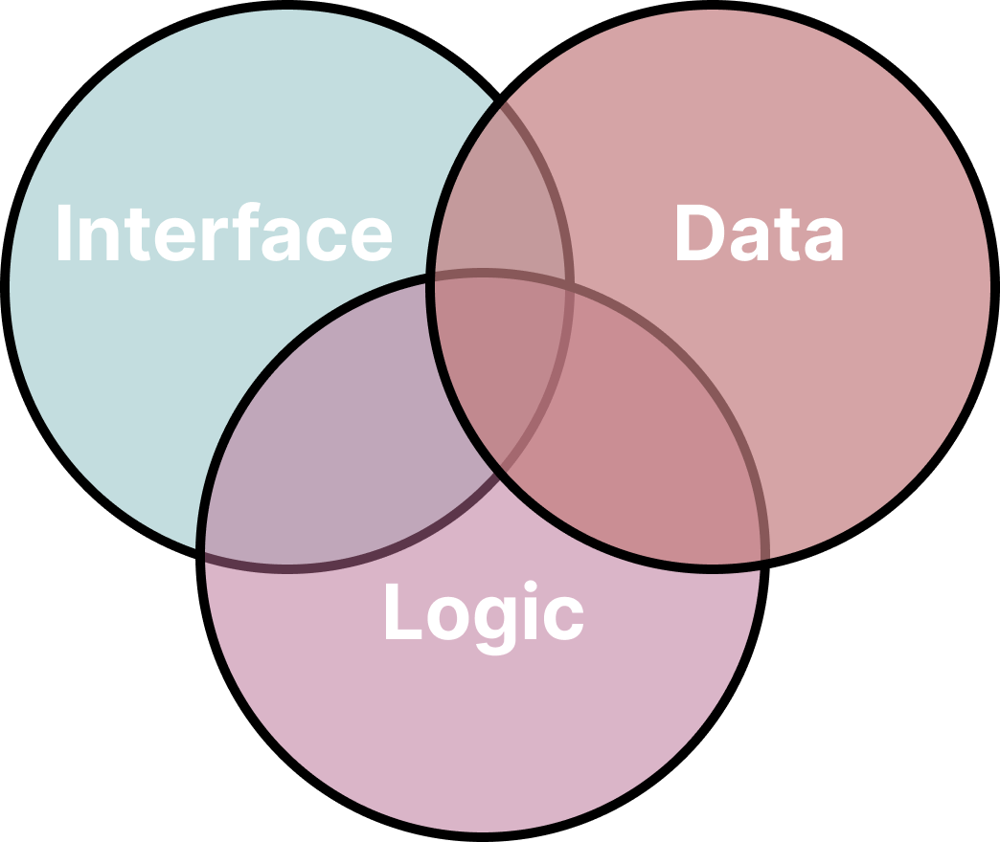

All systems will have these things and it is these systems that still drive the contemporary information and computing environment.

[Back to Contents](#contents)

## Design for Interfaces
It will be common to encounter the concept of an **Application Programming Interface** as being the gateway into and out of a system. This is not to be confused with User Interfaces, Human Computer Interfaces, or OOP Interfaces.  We will focus on APIs as they express the **what** of a system in terms of input, outcomes, and retreival.

[Back to Contents](#contents)

### Common Concepts in Application Programming Interface Development
There are a variety of approaches to this in the Python Language, including not relying on any frameworks beyond what comes with Python and its own Library.

[Back to Contents](#contents)

### Abstractions (in programming and python)
We still write programs that govern the execution of systems and the direciton of the data and logic flows that reside within them.  This is the case despite advances in AI and assistive tools meant to curate and accelerate the development of computer code artifacts.  At this time, while many of these concepts could easily be learned without getting our "hands dirty" with code, that would be a mistake.  We must make ourselves available to conversations and realizations with the materials of our design and these materials are code and data.  

At its heart, writing an API allows other systems to utilize the outputs of a system without understanding **how** these results are obtined. While available actions outcomes are necessarily exposed to others (like a menu of options) without revealing the complexities of the operation; this is a simplification and simplification is a key aspect of using abstractions for modeling.

An answer regarding a fact or expression of system state are common responses provided by an API:

* expressions of fact (functional): output is commonly related to, and a function of inputs (e.g. conversion formulae).
* expressions of state (emphatic or emphemeral): State can vary with time and may not be purely deterministic (e.g. time-based lookups).  

APIs should provide clearn intentions and expections for both inputs and outputs so that the API provides a clear and understandable contract. 

[Back to Contents](#contents)

#### Designing Abstractions
Abstractions present scope and scale from which a system's outputs and benefits can be understood.  In order to develop a good abstraction, a good understanding of what the system represents is also necessary - this understanding is often emergent.

When the process happens organically, the abstractions are decided mostly on the go. There is an initial idea, acknowledged as an understanding of the problem, that then gets tweaked.

Since all models are abstractions, our instincts and inclinations that pervade our understanding of the underlying phemena to which the system attends to will change (and perhaps mature).  

In designing an API you explicitly describe the abstractions that the API will use clarify what the system will provide.  The objective   when modeling is to keep the viewpoint of a user of the system in mind; the purpose of the system is to meet the needs of users.

[Back to Contents](#contents)

#### Opacity and Leaky Abstractions

An abstraction can said to be "leaky" when it ceases to be an opaque "black box" and "leaks" implementation details.

'All non-trivial abstractions, to some degree, are leaky" – Joel Spolsky's Law of Leaky Abstractions

When designing an API, it is important to account for leakiness:

* *Generate clear errors and hints*: A good design will always include cases for things going wrong and try to present them clearly with proper error codes or error handling.
* *Expose and alarm on depedency errors*: When dependencies fail an API should abstract these details with some options for a graceful recovery.  If a graceful landing is not possible, then some terminating signal would be appropriate.

[Back to Contents](#contents)

#### Patterns for Abstractions
A dictionary or key-value-pairing concept is useful for API design as communication can be described as API accessing resources that can perform actions. 

* *Resources* are referenced entities or values.
* *Actions* are performed on resources.

[Back to Contents](#contents)

## Design for Data
If your systems are doing anything useful over time then that data describes the state of a system such that its transactive operations provide some utility and value.  Data is the lifeblood of any system and nearly all other parts share that common interest.

A datum or data will always indicate whether a system is alive and can present and consume records of its lifetime. When we think of data in a computing systems context, what we commonly think of is a database. To this end, we will consider the following:
* Types of Databases
* Database transactions
* Distributed databases
* The relational model
* Schema Design
* Data Indexing

### Types of Databases

The short version, which is presented here, says that there are relational databases, and then the rest:

* **Relational databases**: Leverages the relational model and the Structured Query Language to define and manipulate data and schemas.
* **Non-relational databases**: Functionally, this means other data management paradigms beyond the relational model - [document](https://db-engines.com/en/article/Document+Stores), [key-value](https://db-engines.com/en/article/Key-value+Stores), [object](https://db-engines.com/en/article/Object+oriented+DBMS), [graph](https://db-engines.com/en/article/Graph+DBMS), and [wide column](https://db-engines.com/en/article/Wide+Column+Stores) data stores. 
* **Small or flat databases**: Single file datastores meant to emphasize portability or simplicity. File-based such as XML, JSON, CSV, or even SQLite.

**Note:** Python has rich support for any of these database approaches.

**Note:** [12-Factor App](https://www.methodsandtools.com/archive/12factorapp.php)

### Transaction Management
Data stores become valuable when they facilitate and broker access across many requests and demands.  Most interactions with a database can be expressed in terms of a transaction. Care is needed in managing transactions to ensure enduring intergrity of the underlying system.  For this reason we can speak to the ability for a database system to handle transactions using the ACID acronym:

* **Atomicity** Requirement that transactions are applied as a unit such that they are either wholly successful, or not.
* **Consistency** Requirement that transactions are subject to constraints.
* **Isolation** Requirement that transactions are free from "dirty reads" and "lost updates" such that parallel transactions do not negatively impact each other.
* **Durability** Requirement that completed transactions are preserved, permanent, and free from transient interferance.

These are not magic, but rather what any decent database management system will provide.  In the Relational World, we have [popular Relational Database Management Systems (RDBMS)](https://db-engines.com/en/ranking/relational+dbms) such as:
* **Oracle**
* **MySQL**
* **MS SQL Server**
* **PostgreSQL**
* **SQLite**
* **Snowflake**

### Schemas

When designing data, a schema is created/designed to express the topology of the semantic and physical aspects of data storage and management. More specifically, we are interested in identifying and grouping:

* **fields** - the name and type of a datum to be stored in a collection of data that describes a record.
* **keys** - values within the data that can be used to uniquely retrieve a record in the data store.
* **relationships** - mappings between keys that allow for the selection of sets of related records.

#### Relationship Types

Once relationships are established, we can then speak of a number of types of relationships:
* one-to-one
* one-to-many
* many-to-many


### Indexing and Normalization
Schema design can be refined through processes of data normalization.


Once normalized, data can often be indexed to reduce search time.


[Back to Contents](#contents)

## Modeling Data
Whereas we must attend to the implementation of data, for archictectural purposes, we often abstract data as mong the layers or tiers of our design.  Therefore, we can conceive of an n-tiered, or multitiered architecture for the purposes of reasoning about a system's overall design:


The idea here isn't to [get too hung up on tiers and layers](https://www.hanselman.com/blog/a-reminder-on-threemulti-tierlayer-architecturedesign-brought-to-you-by-my-late-night-frustrations) beyond keeping in mind that abstractions are useful for the processes of designing and reasoning about a system.

### Domain-Driven Design as a Useful Abstraction
We can look to Domain-Driven Design for useful vocabulary from which we can understand how to develop and use abstractions for architectural design.

A DDD approach suggests the importance of the abstractions of models and context.  A Data Model abstracts data management to include state changes and the related business logic that governs state changes for the model. Of significant utility is to devel abstractions that separate applications and implementations.  A DDD encourages that we name these abstractions as methods and attributes that are consistent with the underlying langauge of the domain - as we name it in reality, we should name it in the model.

DDD and Object-Oriented Programming (OOP) provide concepts that encourage designs that reflect the concepts intrinsic to a specific domain of practice. DDD encourages that we explore and define business-oriented interfaces to be included in our Model layer so we can abstract and present a consistent interface that represent the flow of business logic.

DDD serves as a reminder that intimate knowledge of the specific domain, and subject-matter expertise (SME) are required to specify meaningful interfaces.  At its simplest expression, a Data Model simply replicates the database schema -  a class or object is designed that replicates the fields and structure of the database. However, models can be more complex and provide an interface to multiple tables or fields to best reflect actual patterns of use within the domain.

#### Object-Relational Mapping
Object-Relational Mapping (ORM) is the development of a system that transforms and translates from raw database access to in-memory/runtime objects that abstract raw access to the database. An ORM will provide mappings between the collections or tables in a database via the provision of related objects in an OOP environment.

While ORM desribes a technique, ORMs are usually tool/libraries (SQLAlchemy and the DjangoORM are good examples)convert from SQL to Python objects. From a codig standpoint, we replace SQL statements with methods called on the classes and objects that represent the underlying database schema.

Eventually, we rely on migrations to describe object model changes as schema changes, and vice versa.

#### Common Data Model Patterns for Later Exploration

Data modeling leads to our exploration of a few architectural patterns we will explore later:
* Unit of Work
* Command Query Responsibility Segregation

[Back to Contents](#contents)

## RESTful Interfaces for APIs
Representational State Transfer (REST) uses the HTTP protocol standards as a basis for a API communication protocol for applications.  For a system to be considered RESTful, it must:

* Facilitate a Client-server architecture through remote calls made through HTTP.
* *Be Stateless* - such that information salient to a request should be self-contained within the request and independent.
* *Be Cacheable* - the availability of query or result caching should be clear.
* *Be seamlessly layered* -  It is unimportant which layer of the system that requesting client is connected to as the results will always be the same.
* *Provide Uniform interface* - subject to a few key constraints:
    * Resources are identified as a part of the requests.
    * Resource manipulation is effected through representations that provide all of thee required information necessary to make changes to the state of the system.
    * Self-documenting and internally-complete messages
    * Hypermedia as the Engine of Application State (HATEOAS) - system navigation is complete via hyperlinks

With a RESTful API, we are typiclly creating a dictionary or look-up between HTTP methods (Verbs) and operations you are interested in on an entity within your application/project/system.  Often, this facilitates the most basic of **C**reate **R**ead **U**pdate and **D**elete (aka **CRUD**) operations on entities within the system.

This is also a way to think of accessing the resources available within a system.

| Resource      | Partial URI   | HTTP Method | Description |
|---------------|---------------|-----------|--------------------------------------------------------------|
| Collection    | /reports      | GET       | A list operation that returns all elements in the collection |
|               |               | POST      | A list creation operation |
| Single Object | /report/1     | GET       | Get a single element from the collection based on its unique id   |
|               |               | PUT       | Create a single object to be inserted into the collection |
|               |               | PATCH     | An update operation that modifies some data in a record |
|               |               | DELETE    | Delete an object from the collection using its unique id |

The entire point of a REST API is for the HTTP method to clarify the type of transaction you want from the system and for the URI to clarify which resource you are interested and/or to specify how you'd like to query for that resource.

### JSON
In most cases, REST APIs will return [JSON](https://developer.mozilla.org/en-US/docs/Learn/JavaScript/Objects/JSON) which gained prominence over earlier standards like [XML](https://developer.mozilla.org/en-US/docs/Web/XML/XML_introduction).  Either are fine and some of [the earliest tools for REST interfaces](https://developer.mozilla.org/en-US/docs/Web/API/XMLHttpRequest) were assumed to be working with XML.

[Back to Contents](#contents)

### HTTP Verbs in Action

Like many early networking and web protocols, HTTP is straightforward, simple, and pretty easy to grasp as it is not too large.  Here are some excerpts of what would be actual HTTP payload information as clients and servers transact using the HTTP protocol.

The following examples presume we are working with an aviation weather API that provides coded and decoded aviation-related weather information.

***NOTE***:
<mark>
The list of possible media and content types that can be returned in an HTTP request can be found here through the [Internet Assigned Numbers Authority](https://www.iana.org/assignments/media-types/media-types.xhtml).
</mark>

**GET**
```
GET /reports/1
HTTP/1.1 200 OK
Content-Type: application/json
{"icao": "KAMA", "raw": "KAMA 221753Z 18011KT 10SM CLR 09/M01 A2990 RMK AO2 SLP119 T00941011 10100 21006 50004", "updated": "1826 UTC 22 Mon Jan 2024"}
```

**GET with parameter**
```
GET /reports/KAMA/raw
HTTP/1.1 200 OK
Content-Type: text/plain
KAMA 221753Z 18011KT 10SM CLR 09/M01 A2990 RMK AO2 SLP119 T00941011 10100 21006 50004
```

### HTTP Headers and Status Codes
We can also use [HTTP headers](https://developer.mozilla.org/en-US/docs/Web/HTTP/Headers) and [Status Codes](https://developer.mozilla.org/en-US/docs/Web/HTTP/Status) to assist in maintaining application state with respect to the provision and use of a RESTful API.

[Back to Contents](#contents)

### Designing for a Resource Approach

A resource-based view of your system is useful as it is prudent to consider that both state change and derived value come from viewing your system via the transactions it facilitates.  As the a RESTful API, by virtue of leveraging HTTp is limited to CRUD operations, a resource-based view encourages a design where resources are the "lego bricks" for the API your system provides.  Seeing everything as a resource helps to create very explicit APIs and helps with the stateless requirement for RESTful interfaces.

HTTP forces a stateless approach which ensures that all the information required to fulfill a request is initiated by the particulars of the call. What a RESTful API facilitates is the ability of two networked machines to coordinate by makings requests and providing responses. This has also been referred to in the past as [Remote Procedure Calls](https://en.wikipedia.org/wiki/Remote_procedure_call). Being remote, there is both latency and a degree of resource marshalling that must occur to keep these available.  Selecting something stateless, like HTTP, forces useful restrictions on API development which can be beneficial.

[Back to Contents](#contents)

### Notes for a RESTful design

> Here are some notes for RESTful design from Jaime Buelta:
>
> The best way to start designing a RESTful API is to clearly state the resources and then describe them:
>
> * Description: Description of the action
> * Resource URI: Note that this may be shared for several actions, differentiated by the method (for example, GET to retrieve and DELETE to delete)
> * Methods applicable: The HTTP method to use for the action defined in this endpoint
> * (Only if relevant) Input body: The input body of the request
> * Expected result in the body: Result
> * Possible expected errors: Returning status codes depending on specific errors
> * Description: Description of the action
> * (Only if relevant) Input query parameters: Query parameters to add to the URI for extra functionality
> * (Only if relevant) Relevant headers: Any supported header
> * (Only if relevant) Returning status codes out of the ordinary (200 and 201): Different from errors, in case there's a status code that's considered a success but it's not the usual case; for example, a success returns a redirection

[Back to Contents](#contents)

### Additional Items for RESTful APIs

There are other items for consideration when developing RESTful APIs:

* **Documentation**: Tools such as [OpenAPI and Swagger](https://swagger.io/specification/) help to expose both your API and its documentation to facilitate use.
* **Authentication**: One of the drivers of big data is profit where access to API-driven information is ascribed a fee. Among many approaches to this is [JSON Web Tokens](https://jwt.io/).
* **Versioning**: You will also want to version your API so that you can distinguish fixes and features over time.  [Semantic Versioning](https://semver.org/) is a common (and familiar) approach to this.

### Design Targets: Frontend and Backend
Keep in mind that our architecture and design, although commonly associated with the "backend" of an applicaiton ecosystem, can also apply to more client-facing "frontend" components of a system.

Perhaps this picture illustrates these concepts:

<!--  -->


Understanding these broad aspects lends itself to our ability to our architectures in terms of layers and segments.  The general structures that underlies our architectural reasoning lies in the ability to array concerns or focal points into patterns.  We can sometimes understand brokering traffic between frontend and backend using the Model-View-Controller architecture pattern:


[Back to Contents](#contents)

## The Unified Modeling Language
There are a number of visual models we'll want to become familiar with as a tool for expressing various aspects of a system.  The diagrams should ultimately contribute to the code artifacts we produce to facilitate the system's effectiveness.  With that said, these models are themselves artifacts of design; their purpose is to facilitate understanding that leads to an information systems artifact.

[Back to Contents](#contents)

### Select UML Diagrams Overview
Credit to [Scott Ambler](https://scottambler.com/).

| Diagram | Description | Link |
|---------|-------------|------|
| [Activity Diagram](https://agilemodeling.com/style/activityDiagram.htm) | Depicts high-level business processes, including data flow, or to model the logic of complex logic within a system. | [Activity Diagram Guidelines](https://agilemodeling.com/style/activityDiagram.htm) |
| [Class Diagram](https://agilemodeling.com/artifacts/classDiagram.htm) | Shows a collection of static model elements such as classes and types, their contents, and their relationships. | [Class Diagram Guidelines](https://agilemodeling.com/style/classDiagram.htm) |
| [Sequence Diagram](https://agilemodeling.com/artifacts/sequenceDiagram.htm) | Models the sequential logic, in effect the time ordering of messages between classifiers. | [Sequence Diagram Guidelines](https://agilemodeling.com/style/sequenceDiagram.htm) |
| [Component Diagram](https://agilemodeling.com/artifacts/componentDiagram.htm) | Depicts the components that compose an application, system, or enterprise. The components, their interrelationships, interactions, and their public interfaces are depicted. | [Component Diagram Guidelines](https://agilemodeling.com/style/componentDiagram.htm) |
| [Deployment Diagram](https://agilemodeling.com/artifacts/deploymentDiagram.htm) | Shows the execution architecture of systems. This includes nodes, either hardware or software execution environments, as well as the middleware connecting them. | [Deployment Diagram Guidelines](https://agilemodeling.com/style/deploymentDiagram.htm) |
| [State Machine Diagram](https://agilemodeling.com/artifacts/stateMachineDiagram.htm) | Describes the states an object or interaction may be in, as well as the transitions between states. Formerly referred to as a state diagram, state chart diagram, or a state-transition diagram. | [State Machine Diagram Guidelines](https://agilemodeling.com/style/stateChartDiagram.htm) |
| [Use Case Diagram](https://agilemodeling.com/artifacts/useCaseDiagram.htm) | Shows use cases, actors, and their interrelationships. | [Use Case Diagram Guidelines](https://agilemodeling.com/style/useCaseDiagram.htm) |

[Back to Contents](#contents)

### UML Notes

Here are some additional notes about using the UML.

[Back to Contents](#contents)

#### Use Case Diagrams
[What's is the difference between include and extend in use case diagram?](https://stackoverflow.com/a/4472770)

Here’s an approach checked against Jacobson, Fowler, Larmen and 10 other references.

**Relationships are dependencies**
The key to Include and extend use case relationships is to realize that, common with the rest of UML, the dotted arrow between use cases is a dependency relationship. I’ll use the terms ‘base’, ‘included’ and ‘extending’ to refer to the use case roles.

***include***
A base use case is dependent on the included use case(s); without it/them the base use case is incomplete as the included use case(s) represent sub-sequences of the interaction that may happen always OR sometimes. (This is contrary to a popular misconception about this, what your use case suggests always happens in the main scenario and sometimes happens in alternate flows simply depends on what you choose as your main scenario; use cases can easily be restructured to represent a different flow as the main scenario and this should not matter).

In the best practice of one way dependency the base use case knows about (and refers to) the included use case, but the included use case shouldn’t ‘know’ about the base use case. This is why included use cases can be: a) base use cases in their own right and b) shared by a number of base use cases.

***extend***
The extending use case is dependent on the base use case; it literally extends the behavior described by the base use case. The base use case should be a fully functional use case in its own right (‘include’s included of course) without the extending use case’s additional functionality.

Extending use cases can be used in several situations:

The base use case represents the “must have” functionality of a project while the extending use case represents optional (should/could/want) behavior. This is where the term optional is relevant – optional whether to build/deliver rather than optional whether it sometimes runs as part of the base use case sequence.
In phase 1 you can deliver the base use case which meets the requirements at that point, and phase 2 will add additional functionality described by the extending use case. This can contain sequences that are always or sometimes performed after phase 2 is delivered (again contrary to popular misconception).
It can be used to extract out subsequences of the base use case, especially when they represent ‘exceptional’ complex behavior with its own alternative flows.
One important aspect to consider is that the extending use case can ‘insert’ behavior in several places in the base use case’s flow, not just in a single place as an included use case does. For this reason, it is highly unlikely that an extending use case will be suitable to extend more than one base use case.

As to dependency, the extending use case is dependent on the base use case and is again a one-way dependency, i.e. the base use case doesn’t need any reference to the extending use case in the sequence. That doesn’t mean you can’t demonstrate the extension points or add a x-ref to the extending use case elsewhere in the template, but the base use case must be able to work without the extending use case.

**SUMMARY**
I hope I’ve shown that the common misconception of “includes are always, extends are sometimes” is either wrong or at best simplistic. This version actually makes more sense if you consider all the issues about the directionality of the arrows the misconception presents – in the correct model it’s just dependency and doesn’t potentially change if you refactor the use case contents.

[Back to Contents](#contents)

# Software Architecture and Patterns

Software architecture will have a fleeting definitive expression as it bridges organizational, aesthetic, and technical realms.  As such, software achitecture focuses and intersects a number of abilities within those who will design.  Thus, we can characterize software architecture in what it will "attend to."  I like Richards and Ford's model: 

>software architecture consists of the structure of a system, the design intensions the system must support, architecture-influenced design decisions, and design principles.

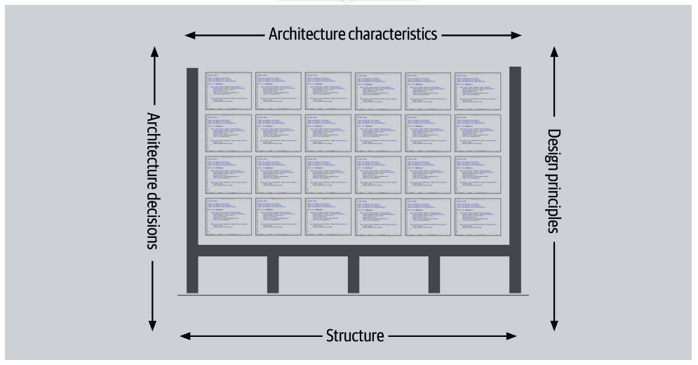

[Back to Contents](#contents)

## On Architecture
Like "Engineering", claiming to be an architect, or to develop architecture, is subjective despite the degree to which both the engineering and architecture disciplines and professionals have tried to protect these.

Therefore, it would be most useful to understand these:
1. What is the difference between achitecture and design? 
2. How to maintain technical depth and breadth.
3. How to recognize and evaluate design tradeoffs inherent in solution technologies and patterns.
4. Understand how the business and problem domains drive architectural decisions.

I like Richards and Ford's Technical depth and breadth model here: 

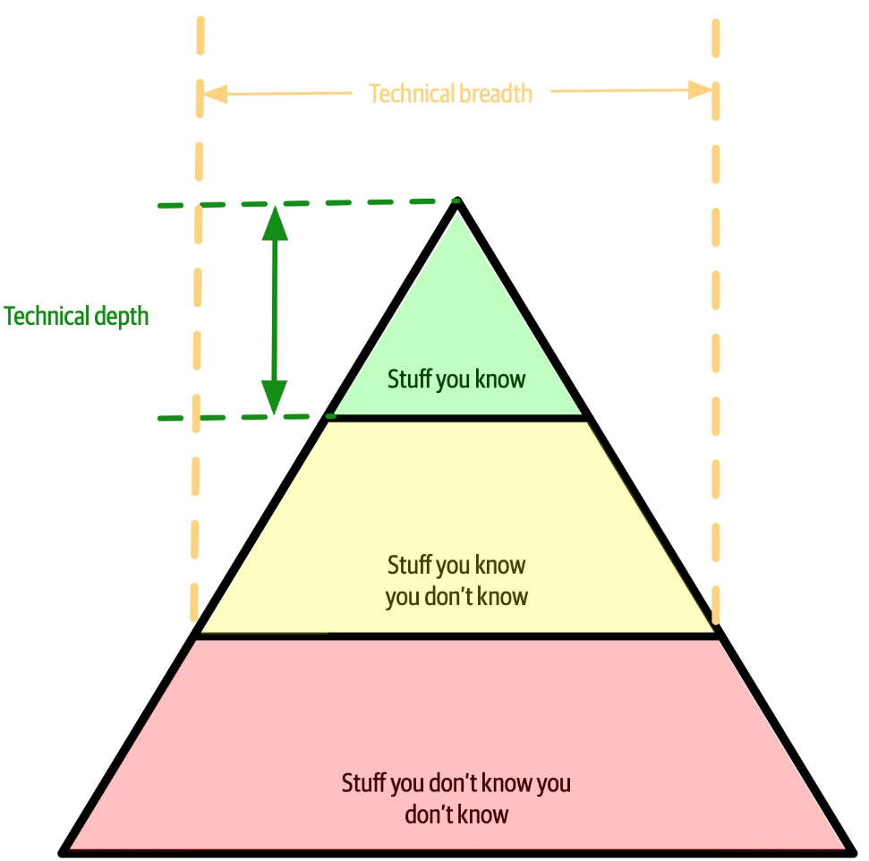

## Conceptual Foundations: Modularity
While a foundational grasp of both Object-Oriented Programming and the Unified Modeling Language are ideal pre-requisites, there are pragmatic ways of understanding Modularity in software and systems development.

* A *module*: `a set of standardized parts from which a more complex structure can be crafted`
* *Modularity*: `A logical grouping of related code - often classes - designed for effective reuse - package, module, or namespace`

Aspects of measuring and identifyin modularity follow:

* **Cohesion**: `To what extent part of a module are naturally bound (thematically, funtionally) and thus belong together.`  We can reconcile with cohesion by considering whether that cohesion is functional, sequential, communicative, procedural, temporal, or logical.
* **Coupling**: `Degree to which items are connected such that both are commonly involved at the same time, within the same sequence, or within the same logical dependence.` We can reconcile with coupling by considering whether modules are related through abstractions, call distance, or instability of implementation.
* **Connascense**: This is a more acute coupling where `items within a module are coupled when changes in one module require changes in another - they are codependent.`

Modularity is a necessary part of architectural design.

## Conceptual Foundations: Architectural Characteristics
Since all software systems solutions will involve both domain requirements and architectural characteristics, an understanding of architectual charactistics will be useful here.

An architectural characteristics can be understood as classified in more or more of the following:
* Specifies a nondomain design consideration/need.
* Incluences or supports necessary design structures.
* Is critical to application success.

Richards and Ford have a nice model of this:

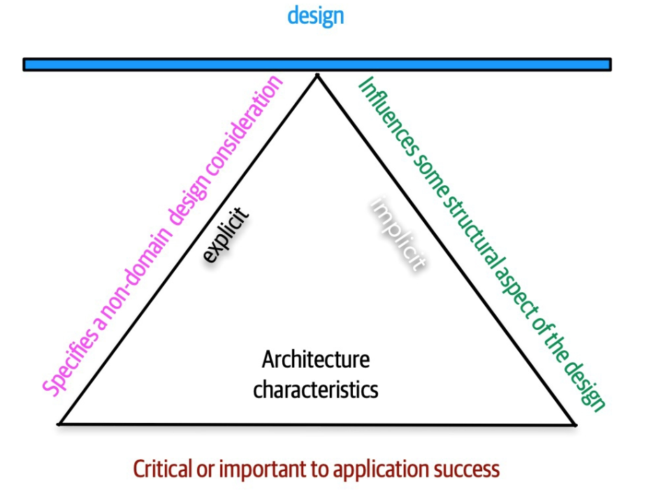

### Examples of Architectural Characteristics

Again Richards and Ford provide some nice examples:

**Operational Architecture Characteristics**
<hr>

| Characteristic        | Definition            |
|-------------------|-----------------------|
| Availability      | "Uptime" |
| Continuity        | "Risk management and disaster recovery" |
| Performance       | "Resilience, horsepower, abundance " |
| Recoverability    | "Restoration after disaster" |
| Reliability       | "Connected to availability" |
| Robustness        | "Continuity during error and boundary conditions" |
| Scalability       | "Factors of 10" |

**Sturctural Architecture Characteristics**
<hr>

| Characteristic    | Definition            |
|-------------------|-----------------------|
| Configurability   | "Built to accommodate options and customization" |
| Extensibility     | "Add to function by plugging in new capabilities" |
| Deployability     | "Where can this be operated from?" |
| Reusability       | "Can this solution be used in other contexts?" |
| Localizable       | "Can this solution support location and context?" |
| Maintainability   | "Cost in time and skill" |
| Portability       | "Can we migrate to new operating environments?" |
| Supportability    | "What is the extend of support needs" |
| Upgradeability    | "Backwards compatibility" |

**Other Architecture Characteristics**
<hr>

| Characteristic    | Definition            |
|-------------------|-----------------------|
| Accessibility     | "Compliant with provisions to broadly support a variety of users." |
| Archivability     | "What data needs to be retained and for how long" |
| Authentication    | "You are who you say you are" |
| Authorization     | "You can use this, but now that" |
| Legal             | "Stay within the lines of what is permitted" |
| Privacy           | "Visibility and control over that visibility" |
| Security          | "CIA" |
| Exertise/Skill    | "Expected user skill level required." |

See also: [the ISO25010 standards on Software Product Quality](https://iso25000.com/index.php/en/iso-25000-standards/iso-25010)

[Back to Contents](#contents)

## Software Architecture Patterns 1
A design pattern is a shortcut that builds on prior knowledge gained from trial and error that culminates in common approaches to common needs and issues that arise in the design of a system. I am borrowing from a few inputs here to develop an amalgam of patterns and approaches:

* [The Twelve-Factor App](#the-twelve-factor-app)
* [Web Application Architectures](#web-application-architectures)
* Event-Driven Architectures
* Command-Query Responsibility Separation
* Scope and Structures in Microservices and Monoliths

### The Twelve-Factor App
The [Twelve-Factor App](https://12factor.net/) is an methodology to facilitate that software is commonly delivered as a service.  The 12-factor approach emphasizes:

* **Delarative** configurations that encourage the use of automation.
* Configuration that ensures a **clean contract** with the underlying operating system for **portability** between execution environments.
* Oriented towards deployment on **cloud platforms** to minimize servers and systems administration.
* Minimize divergence between **development** and **production** environments continuous deployment.
* Facilitataes scaling without significant changes to tooling, architecture, or development practices

The twelve-factor methodology is a design patterns as it stems from solutions to common and systemic in application development.  The twelve-factor methodology provides a vocabulary and lexicon that conceptualizes common problems and solutions. The ideas in the twelve-factor methodology are inspired by Martin Fowler’s books:

#### [Patterns of Enterprise Application Architecture](https://martinfowler.com/books/eaa.html)


#### [Refactoring](https://martinfowler.com/books/refactoring.html)


### The Twelve Factors

| Factor    | Concept |
|-----------|---------|
|1. [Code base](https://12factor.net/codebase): One codebase tracked in revision control, many deploys. |  |
| 2. [Dependencies](https://12factor.net/dependencies): Explicitly declare and isolate dependencies. | &nbsp; |
| 3. [Config](https://12factor.net/config/): Store config in the environment. | &nbsp; |
| 4. [Backing services](https://12factor.net/backing-services): Treat backing services as attached resources. |  |
| 5. [Build, release, run](https://12factor.net/build-release-run): Differentiate between build and run states. |  |
| 6. [Processes](https://12factor.net/processes): Execute the app as one or more stateless processes. | &nbsp; |
| 7. [Port binding](https://12factor.net/port-binding): Export services via port binding.| &nbsp; |
| 8. [Concurrency](https://12factor.net/concurrency): Scale out via the process model. |  |
| 9. [Disposability](https://12factor.net/disposability): Maximize robustness with fast startup and graceful shutdown. | &nbsp; |
| 10. [Dev/prod parity](https://12factor.net/dev-prod-parity): Keep development, staging, and production as similar as possible. | &nbsp; |
| 11. [Logs](https://12factor.net/logs): Treat logs as event streams. | &nbsp; |
| 12. [Admin processes](https://12factor.net/admin-processes): Run admin/management tasks as one-off processes.  | &nbsp; |

### 12-Factor Concepts: Continuous Integration
Continuous Integration (CI) features compulsory automated testing when code is committed to a central repository. The objective CI is to ensure that only working code makes it to production. This is an empirical approach that favors feedback to minimize errors and increase the speed of delivery. Automated testing is designed to produce quality code by relying on quality tests which emphasizes the need for test quality.

CI systems will run tests automatically upon either detecting changes or by being triggered by other workflow automation. Test area comprehensive and may be time consuming depending on the size and scope of a project. Commonly, tests are run when new changes in the code base are detected. Git, and [GitHub](https://github.com/) or [GitLab](https://about.gitlab.com/), provide "hooks" to assist in controlling test automation. We learn how to use GitHub Actions for to create conditional or event-driven CI actions.  It is common to refer to the process of CI in terms of a "pipeline," or a series of treatments and tests run in the interest of implementing CI.

A pipeline may look like this:

* A project workspace is configured to work with CI automation - usually 3rd party libraries and configuration files.
* Explicit build commands are executed to prepare the code for further use.
* Static Code Analysis ([linters](https://en.wikipedia.org/wiki/Lint_(software))) tools like [flake8](https://flake8.pycqa.org/en/latest/) or [black](https://pypi.org/project/black/) are used for linting and code style conformity.
* Unit tests run and the pipeline stops on errors.
* If unit tests pass, downstream integration tests can be run as well.

All CI pipelines presume some, or total, automation: all stetps in the pipeline are designed to be run without monitoring or assistance.  Thus, dependencies must also be a part of the CI configuration.  It is also common to include virtual machines as a part of the automation to ensure testing environment that mirrors the expected operating environment.

### 12-Factor Concepts: Scalability

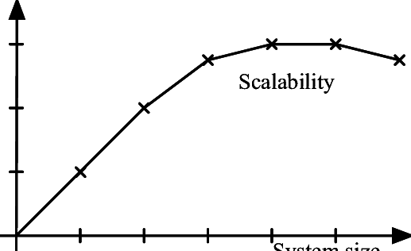

Application systems ideally behave consistently under a range of demand loads. This is a system behavior that is designed automatically increase resources to accommodate more demand.  This can be achieved using two main approaches:

* **Vertical scalability**: Increase resources at each system node.
* **Horizontal scalability**: Increase the number of system nodes at the same resource level.

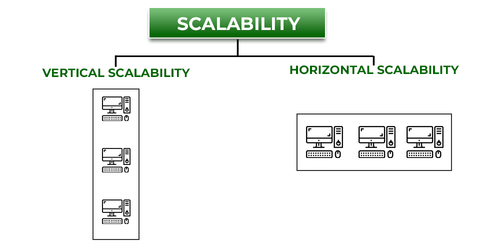   

### 12-Factor Concepts: Configuration

The Twelve-Factor App encourages the view that both code and configuration are vital assets to be managed equally.  This is manifest in the concept of [Configuration as Code](https://www.cloudbees.com/blog/configuration-as-code-everything-need-know).

The concept of configuration and code being equal assets is readily visible in the widespread use of virtual machines and app containers, where both exists to ensure a stable and known execution environment.  Configurations are the set of parameters used to indicate the settings and behaviors required for the system to support the application's execution:

Here is a way to think of these configuration parameters:

* **Operational configuration**: These parameters connect different parts of the system or that are related to monitoring: 
    * credentials for the database
    * service URLs 
    * Log and system settings
* **Feature configuration**: These parameters change external behavior, enable features or change the behaviors of the system:
    * UI settings 
    * Enabled app behaviors
    * Defining constants or macros

*Operational* configurations are typically concerned with deploying and running your app/system and often help distinguish between a local development environment and a production environment.

Like code, operational configurations usually stored in files and organized by the referenced target environment. This also means that configuration changes are code changes. There are issues with this approach in the case of horizontal scaling where threats related to duplication and misalignment may occur between resources nodes.

In general, the Twelve-Factor App suggests using Environment Variables as a result.

### 12-Factor Practices

We can group the 12-factor practices to better understand their practical implementations:

* *Portability*: Code base, Build, release, run, and Dev/prod parity. 
    * Git and GitHub/GitHub Actions
    * VMs, VPSs, Containers
    * PaaS, IaaS, SaaS
* *Service configuration and connectivity*: Config, Dependencies, Port binding, and Backing services
    * Favor the use of Environment Variables and similar strategies (dot env)
    * Map services to TCP/IP ports
* *scalability*: Processes, Disposability, and Concurrency 
    * Processes represent conceptual/semantic areas of responsibility
    * Work with operating system-level features to manage processes (Windows/Linux)
* *monitoring*: Logs and Admin processes
    * Metrics and loggin as key health, security, and performance tools
    * major state changes
    * Reporting

The 12-factor can be restarted, within the groups above, as supporting the following principles:

* **Build once, run multiple times** - Generating a single application package that runs in many environments.
* **Dependencies and configuration** - Manage configuration, software and service dependencies of the application as an equal resource.
* **Scalability** - Strategies to facilitate scalability.
* **Monitoring and admin** - Manage the operation of the software and system.

### Web Application Architectures
It is almost redundant to speak of application architecures and then speak of the architecture of Web/HTTP server architectures as the Web is the primary application/protocol delivery "stack." As any distributed system architecture will require remote access, Web services based on HTTP are ubiquitous and will be our sole focus.  

__*Our principle points of study will be*__:
* The structure of HTTP servers
* The HTTP request-response paradigm  
* three-layer application design: 
    * web server - HTTP
    * worker processes - Work that you design, independent of HTTP
    * service layers that direct worker processes and interact with the web server - and Application server to coordinate between HTTP and your worker processes.

__*Example with Django*__:
* HTTP Server: nginx
* Application Service Layer: uWSGI
* Worker Specification and Web Application Framework: Django
* Data-only API Web Application Framework: Django REST framework

#### HTTP Request and Response

In general, request–response or request–reply is a basic method that computers use to communicate with each other over a network: machine A sends a request for some data and machine B responds to the request. This is duplex messaging pattern which allows two applications to have a two-way conversation with one another over a channel and is especially common in client–server architectures.

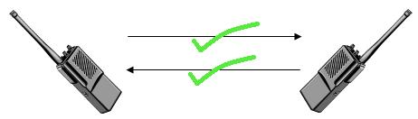

The request-response pattern is often implemented  synchronously such as in our use case of interest where a web service calls over HTTP, which holds a connection open and waits until the response is delivered or the timeout period expires. Request–response may also be implemented asynchronously where a response can be received later. Even with synchronous communication, there is communications latency within the request and response cycle endemic to the nature of sending and processing electro-magnetic energy. When communications occur within the machine, latency can be measured in a few milliseconds.  However over internetworked communications, latency can be measured in hundreds of milliseconds, or worse.  These variations in time are a key component of how the HTTP, TCP, and IP protocols work together.

In implementation, most requests are made synchronously such that process execution halts and waits for a response. The latency involved in waiting requires error handling that needs to consider different failure cases and provisions to reattempt the communication.

The request-response is a call and response pattern where the responder does not contact the caller proactively. This simplification suggests that such communications are not truley Duplex, but effectively so. In the request-response pattern, the client is required to initiate the request where the server's role is to listen to and respond to these requests. Again, a basic request-response communication is not fully bidirectional communication. The server polls to check whether there are new messages.  Despite its drawbacks, the request-response architecture forms the basis of web services.

#### The MSDN Illustration of HTTP Request and Response

This is easier to comprehend if we borrow from the Mozilla Developer Network's documentation on [HTTP messages](https://developer.mozilla.org/en-US/docs/Web/HTTP/Messages).

In the image below, we see the major components of how the [Hypertext Transfer Protocol](https://developer.mozilla.org/en-US/docs/Web/HTTP/Overview) works:


Using packet sniffers such as wireshark, the payload of these messages can be examined as the protocol works with very simple plaintext messages:


##### Anatomy of the HTTP Request


1. The client sends the HTTP a message containing a `request line`:
    * An [HTTP Method](https://developer.mozilla.org/en-US/docs/Web/HTTP/Methods) is stated
    * A `request target` is specified: a URL, or the absolute path of the protocol, port, and domain
    * Specification of the HTTP Version
2. The Client clarifies the request using [HTTP Headers](https://developer.mozilla.org/en-US/docs/Web/HTTP/Headers). Generally, the types of specifications communicated in the header are:
    * [General headers](https://developer.mozilla.org/en-US/docs/Glossary/General_header)
    * [Request headers](https://developer.mozilla.org/en-US/docs/Glossary/Request_header)
    * [Representational headers](https://developer.mozilla.org/en-US/docs/Glossary/Representation_header)
3. Body - only some requests have bodies, depending on the nature of the HTTP request.  There are typically two categories of bodies:
    * Single-resource - `Content-Type` or `Content-Length`
    * Multi-resources - HTML Forms are a good example.

##### Anatomy of the HTTP Response


1. The server responds to an HTTP message starting with a `status line`
    * `Protocol version`
    * [HTTP Response Status Code](https://developer.mozilla.org/en-US/docs/Web/HTTP/Status) - these can be key in denoting state when HTTP is coopted to develop an API.
    * `Status text` which is an informational and informal addendum to the status code.
2. The response also uses headers, which nearly identical in form and purpose to request headers.
3. The `response body` forms the essence of the request-response chain as the answer contains the "value" of the transaction.  Again we have a few categories for the response body:
    * Single-resource bodies: `Content-Type` and `Content-Length`
    * Single-resource bodies with follow-on data: consists of a single file of unknown length, encoded by chunks with `Transfer-Encoding` set to `chunked`.
    * Multiple-resource bodies: a multipart body with each part containing a different section of information. 

### Typical FOSS Web Achitecture

A common free and open source software-driven web application architecture will conceptually look like this:


We can see the following elements:
* Web Server
* Web Application Server
* Application Server (Workers)
* Database


We'll focus on nginx, uWSGI, and Django as working examples.

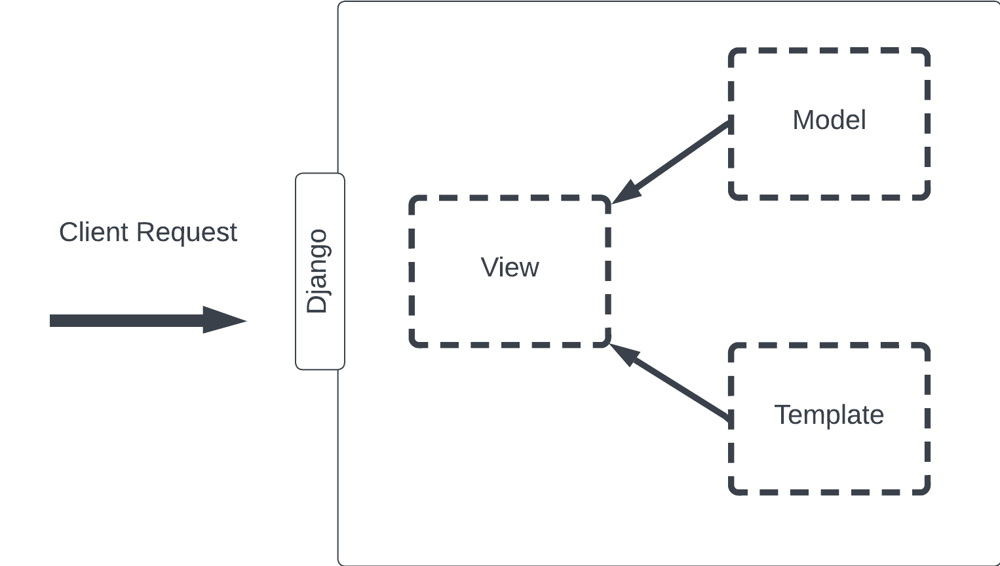

Using a separate example, we'll see Django and the Django Rest Framework used to illustrate a full web application architecture.  In general, we'll leverage Django, the DRF, and any WSGI app container to perform key communication and data handling aspects of our archictures.  This will leave the matter of work and workers to our own design.

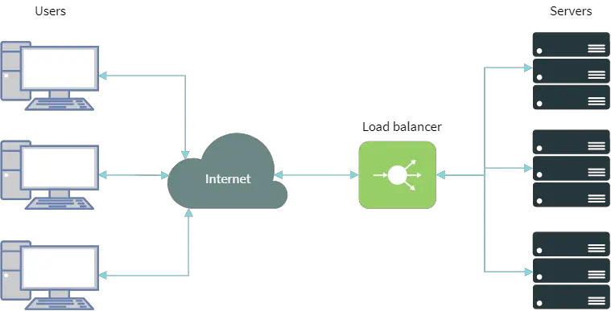

We could then use [containers and other load balancing strategies](https://www.digitalocean.com/community/tutorials/how-to-scale-and-secure-a-django-application-with-docker-nginx-and-let-s-encrypt) to scale our application.

[Back to Contents](#contents)

## Software Architecture Patterns 2

Our journey through patterns becomes a bit more abstract here as we examine ways to structure our modeling of data, our work and workers, and our methods for communicating within and without our software system.  We will proceed with the following subjects:

* Event-Driven Architectures
* Command-Query Responsibility Separation
* Scope and Structures of Microservices and Monoliths

### Event-Driven Architectures

asedf

### Command-Query Responsibility Separation

asedf

### Scope and Structures of Microservices and Monoliths

asedf

[Back to Contents](#contents)

[Back to Contents](#contents)

# The Software Architect

Since we are reasoning about software architecture, it might be useful to also reflect the software architect.  There are reasonable questions to start with:

1. `What do software architects do?`
2. `What artifacts do they produce?`
3. `How can we reconcile and quality the skills and competencies of a software architect?`

Answering these questions would permit a competency or capability model for the software architect.

## Desireable Strengths

We can reflect on things that would make for a good architect:

* **Org. Culture**: Sensitivity to, and ability to worth within, institutional/organizational culture - the essence of the domain lies within this culture
* **Strategically Astute** - Strategic thinking is a natural and default mode for you.
* **Leadership** - Leadership is not simply "being the boss," but someone who is willing to seek solutions and value in the face of uncertainty.
* **Solution and Design Oriented** - Problems await structured solutions that resonate with the design needs of the organization.
* **Integration-minded** - You seek whole/part understanding to see "how the pieces fit."
* **Domain-oriented** - Subject matter expertise within the problem domain is matched and balance with your fondness for the solution domain.
* **Socially Empathetic** - Domain affinity is matched by sensitivy to the people and processes that are impacted by solutions.
* **Mastery Path** - You engage within the mastery path with a certainty that you can both leverage and improve your skills

[Back to Contents](#contents)

## Desirable Perspectives

The emprical output and artifacts of the architect will be realized as specifications and requirements for the system to be built.  This is how the Software Architect is more than just an engineer as the artful aspects of design are also present.  However, there are fluencies in design, and the materials of design, that architects and engineers share.

What distinguishes the architect is the thoughful inclusion of domain.  It is the consideration of domains that lead to design instructions from the architect that preserve and linkage across and through domains.

Requirements are typically answers to the following questions:

* **Events** - What are the events that the system will model?
* **Entities** - What entities exist within the system such that their state can be adequately described?
* **Business/Domain Rules** - What are the operational rules of play within the system to perserve desired relationships within the system?

## Domains of Expertise

There are two vital domains of expertise that are essential for developing systems architectures:

* *Problem Domain*: At the heart of the business of the organization lies the understanding of the key factors that shape the organization:
    * Industry segment
    * Motivations
    * Threats
    * Opportuntities
    * Risk
* *Solution Domain*: The technical competency and disposition of the organization such that it can design, procure, implement, manage, and leverage information systems assets.

Where these worlds meet can be seen in this diagram (credit: Michael Bell):

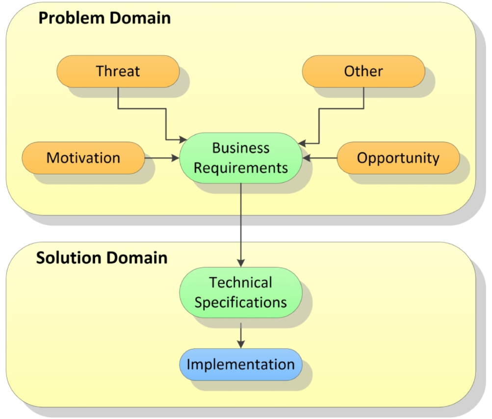

## Bell's Model
Michael Bell offers a model of Software Architecture competency that facilicates our understanding of software architecture. We can understand the Software Architect's responsibilities through key activities, deliverables, and competencies:

1. Requirements - Excel at developing and brokering systems requirements
2. Practices - Engage in key practices and methods that support domain requirements
3. Discipline - With a mastery focus, develop expertise within denoted problem/solution domain pairings.
4. Deliverables - With a mastery focus, delivered artifacts will be subject to continuous improvement.
5. Duetero Learning - With a mastery focus, engage in organizational and professional [metacognition](https://en.wikipedia.org/wiki/Organizational_metacognition) that reasons with the progress of the mastery focus.

How these elements come together is illustrated in Michael Bell's model below:

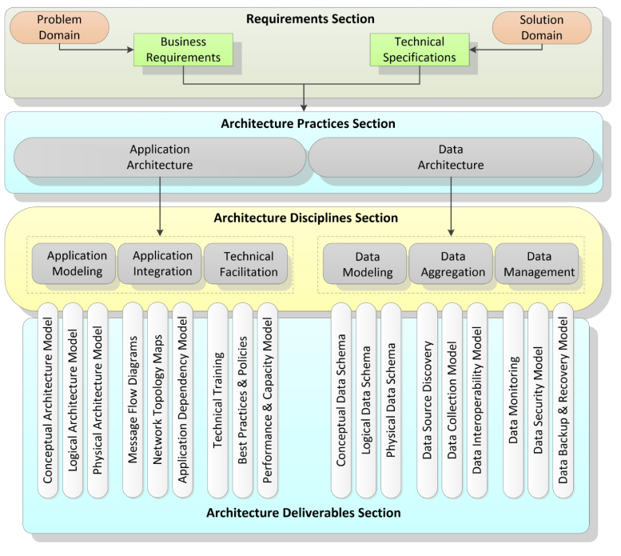

It is important to note that Michael Bell's model is not a means to understand the prototypical Software Architect, but rather to identify the type of Software Architecture competencies and capabilities required within a given design context.  This is so as an experienced architect will be, at least, the sum of their experiences.  Should the architect be a reflective practitioner, they may may realize the "synergy" that exceeds sum of parts.

[Back to Contents](#contents)

# MISC

[Relative paths in README files at GitHub](https://docs.github.com/en/repositories/managing-your-repositorys-settings-and-features/customizing-your-repository/about-readmes)

[Back to Contents](#contents)